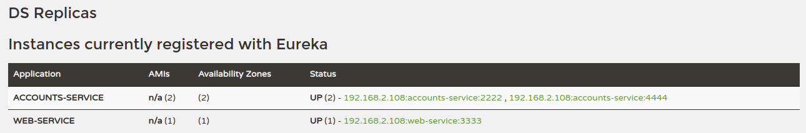
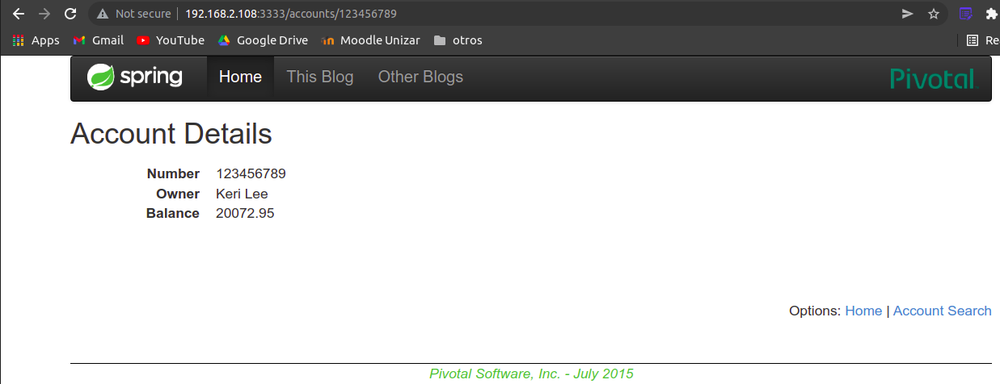

# Launching and registering the first services
The registration service was launched first, with 
`./gradlew :registration:bootRun`.
Afterwards, the account service was launched with `./gradlew :accounts:bootRun`, and then the web service, with `./gradlew :web:bootRun`.

The logs of account (left terminal) and web (right terminal) services can be seen in the image below.

Connecting to `localhost:1111` with a browser shows that both services are registered:

# Second account service
To run a new account service in the port 4444, the port specified in `accounts/src/main/resources/application.yml` was modified, and the service was launched in a new terminal with the same command as before.

The image below shows the logs of both account services running simultaneously (left terminal shows the service with port 2222 and right terminal shows the one with port 4444).

The eureka web page shows the new service is also registered:

## Killing the service with port 2222
The web service asks a different account service for each petition.
When 2222 is killed, some petitions go there and some go to 4444, so at first some fail and some are correct, until the registration service discovers one of them failed and stops serving it.

When petitions are directed to the service with port 2222, the following error is shown:

When they are directed to the one with port 4444 instead, the data is correctly displayed:

We can check that the registration service stops serving the failed account service by connecting to it and seeing there is only one of them among the registered instances:
